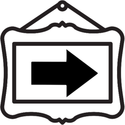
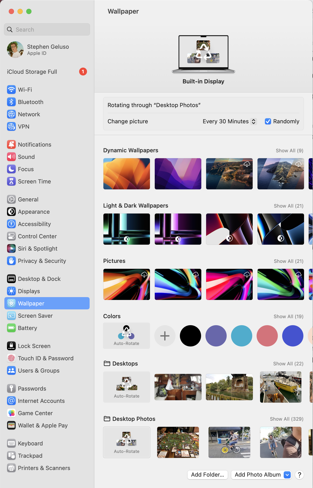

# Next Wallpaper



This is a menu bar app that triggers changing to the next wallpaper image in
MacOS.

I have my laptop set up with a directory of hundreds of my favorite photos. Not
every photo is cropped and scaled to show up well as a desktop photo. Instead
of curating the set of photos I'd like an app that simply allows me to manually
skip through photos I don't like as desktop wallpapers.

Your wallpaper must be set to show photos from a folder changing them randomly
on some timestep. See the screenshot of system settings at the end of this
README.

## Example


## TODO

* Refer to the `TriggerNextDesktop.scpt` file by bundling it in the application
  instead of hard coding it in my own user path.

## Install
Until the script is bundled with the application you must create the script
and manually place it in the Application Scripts directory.

1. Create a file called `TriggerNextDesktop.scpt`.
2. Put the contents of the AppleScript in the file.
3. Copy the file to the Application Scripts directory
4. Update the hard-coded `path` variable in `NextDesktopPhotoApp`

```
#!/usr/bin/osascript

tell application "System Events"
    tell current desktop
        set initInterval to get change interval
        set change interval to initInterval
     end tell
end tell
```

```
cp ./TriggerNextDesktop.scpt "/Users/geluso/Library/Application Scripts/-tephen.com.NextDesktopPhoto"
```

```
let path = "/Users/geluso/Library/Application Scripts/-tephen.com.NextDesktopPhoto/TriggerNextDesktop.scpt"
```

## Settings


